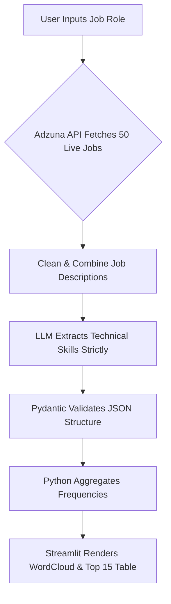

<div align="center">

# 🎯 SkillPulse AI
**Real-Time Data-Driven Tech Skill Intelligence**


---

</div>

### 📖 The Problem: The "What Should I Learn?" Dilemma
Every day, thousands of engineering students, bootcamp grads, and junior developers ask the same question: *"What tech stack should I actually learn to get a job?"*

They typically endure the same gruelling process:
1. Search across 5 different job boards.
2. Manually read 50+ dense, confusing job descriptions.
3. Try to mentally guess which skills appear the most.

**The result?** Candidates waste hundreds of hours studying frameworks no one uses, guided by outdated YouTube tutorials rather than real, current market demand. This process is slow, biased, and incredibly frustrating.

### 💡 The Solution: SkillPulse AI
SkillPulse AI is a deterministic, AI-powered intelligence pipeline that automates the entire research process.

Instead of guessing what the market wants, **SkillPulse AI tells you.** 

You provide a job role (e.g., "Backend Developer"), and the system instantly:
- Fetches 50 real, live job postings in India using the Adzuna API.
- Cleans and consolidates the textual data.
- Passes the data to an LLM (Gemini 2.5 Flash) specifically prompted to extract *strictly technical skills*.
- Aggregates the data and builds an instant, deterministic **Skill Cloud** and a Ranked Frequency Table.

What used to take 3 hours now takes **15 seconds.**


### 🏛️ Architecture & Tech Stack

This project was built with a strict focus on a clean, deterministic architecture. It isn't an autonomous agent guessing answers; it's a strict data pipeline using AI exactly where it's needed: extraction.

*   **Core Logic:** Python
*   **Frontend UI:** Streamlit (For rapid, data-focused deployment)
*   **Data Source:** Adzuna Jobs API (Legal, structured JSON delivery)
*   **LLM Engine:** OpenRouter (Google Gemini 2.5 Flash for high-speed, huge-context JSON extraction)
*   **Validation:** Pydantic (Strict schema enforcement)
*   **Visualization:** Matplotlib & WordCloud

#### The Pipeline Flow



### 🛠️ How to Run Locally

Want to run SkillPulse AI on your own machine? It's easy!

**1. Clone the repository**
```bash
git clone https://github.com/Maaiz-Shaikh/skillpulse-ai.git
cd skillpulse-ai
```

**2. Set up your Virtual Environment**
```bash
python -m venv venv
source venv/bin/activate  # On Windows use: .\venv\Scripts\activate
```

**3. Install Dependencies**
```bash
pip install -r requirements.txt
```

**4. Configure APIs**
1. Rename `.env.template` to `.env`.
2. Get a free API Key from [Adzuna API](https://developer.adzuna.com/).
3. Get a free API Key from [OpenRouter](https://openrouter.ai/). 
4. Paste the keys into your `.env` file!

**5. Launch it!**
```bash
streamlit run app.py
```

### 🤝 Contributing
SkillPulse AI was built to solve a real-world problem cleanly and efficiently. We welcome PRs for adding location-based filtering, salary correlation, and historical skill trend tracking!